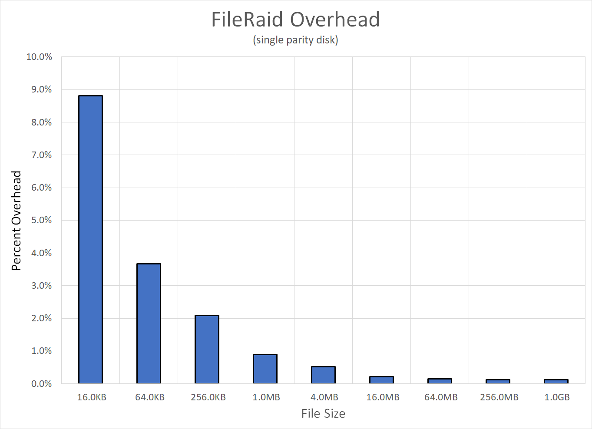

# FileRepair
Investigating ways to repair files from checksum/parity info, in the event of unrecoverable disk errors.

The current program calculates one or more RAID-5(-ish) parity blocks across the file by treating the file
as a set of "virtual disks".  Each virtual-disk is checksummed so that we can detect per-disk damage.
As per RAID-5, if a (single) virtual-disk is found to be damaged (checksum doesn't match), then we
can repair the file by re-calculating the damaged disk from the parity blocks.

The number of "virtual disks", the per-disk block size, and the total number of parity disks
may all be varied.

## Usage

* fileraid
.. The main code; can create a RAID-5 parity file, can verify from an existing file, and can repair
.. a damaged file from the parity info

## Overhead Estimates
The number of virtual-disks and per-disk block size can be varied independently.  This allows us
to find different "sweet spots" for any file-size.  Increasing the number of virtual-disks increases
the number of checksums we have to store; increasing the block-size increases the size of the
virtual parity disk that we have to store.

## Utilities/Additional Scripts:
* adderror.py
.. Adds bit- or byte-sized errors to an existing file; used for testing

* showbits.py
.. Similar to hexdump, prints out the bits or bytes in a given file

* makemockup.py
.. A start at recording the "important" bits that changed inside a damaged file.  Right now, it just
.. dumps all changed bits, one at a time.

* maketest.py
.. Uses adderror.py and the output from makemockup.py to create a file that is similar (in damage
.. structure) to another file.  I.e. it lays down a set of random bits, then twiddles the ones
.. that got twiddled in a previous damage-event.

* basicrepair.py
.. Attempts a brute-force reconstruction of a damaged file from it's original checksum.
.. This just walks through all possible single-byte errors that may have happened to the
.. file, and checksums each one to see if it matches.

